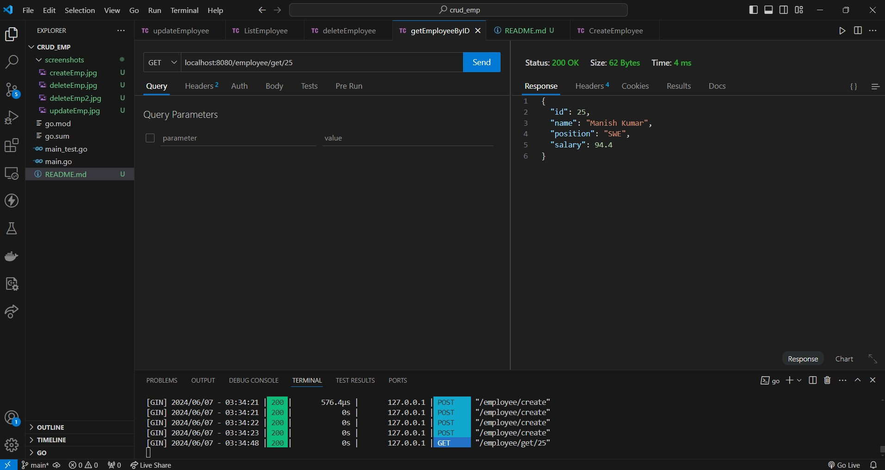
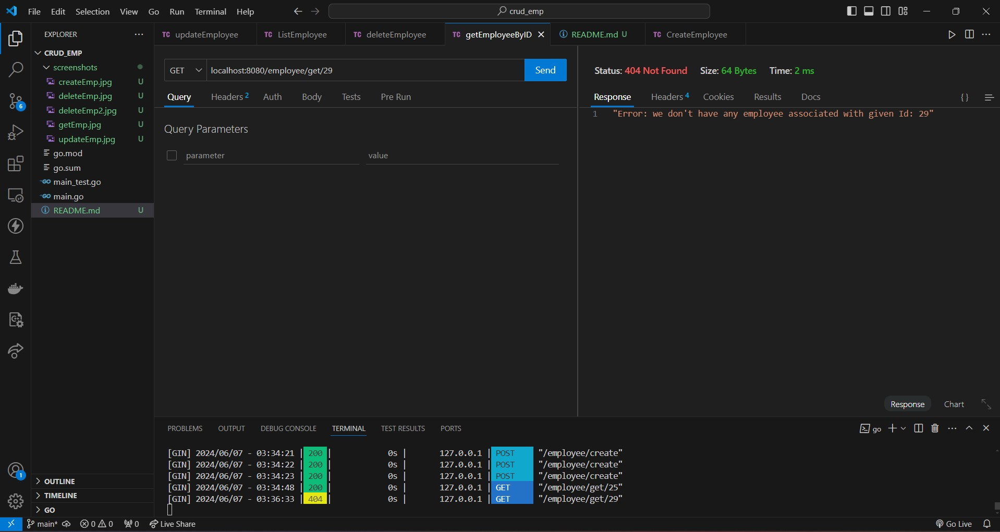
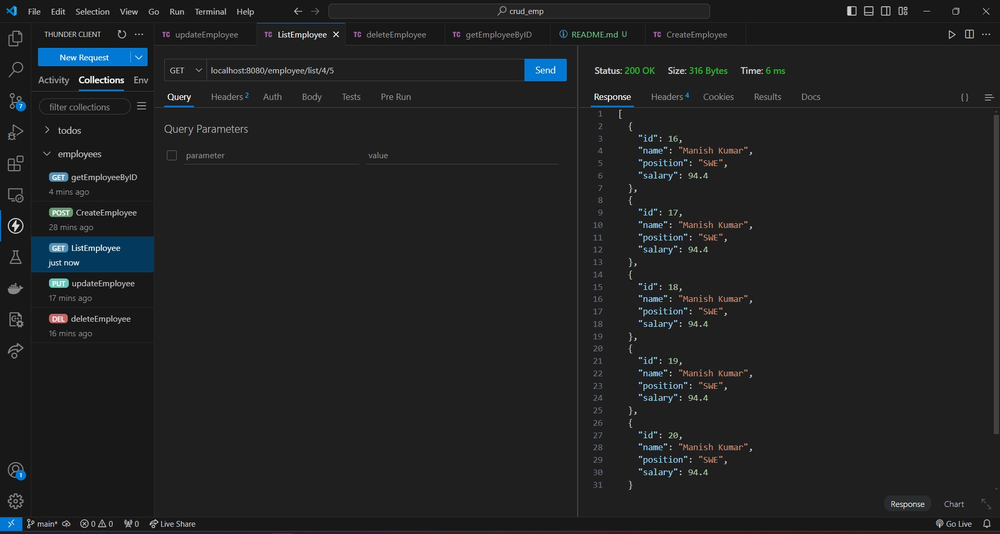
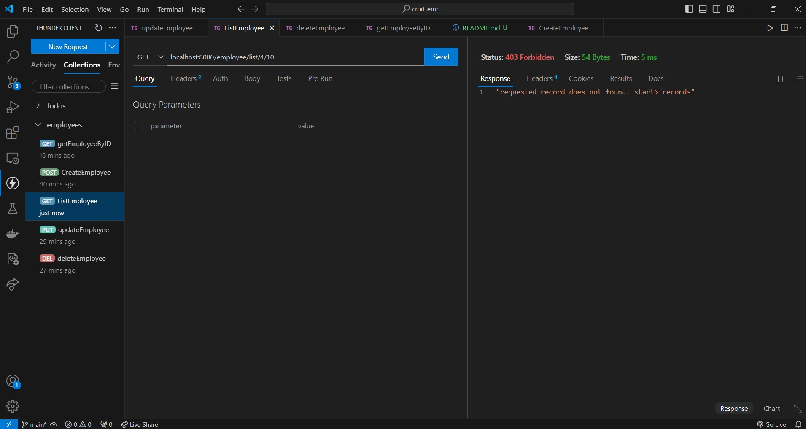

# GoCRUID App

## How to start Application:
```bash
git clone https://github.com/mk46/crud_emp.git
cd crud_emp
go mod tidy
go run main.go
```

## How to test Application:
```
cd crup_emp
go test . ## Without verbosity
go test . -v ## with verbosity
go test . -v --cover ## With code coverage
```

## The Request Response Sample of this application

### 1. Create Employee:


### 2. Update Employee


### 3. Delete Employee


Sending again delete request with same will cause into error as below.


---
**NOTE**

To performing step 4 and step 5, added 25 employees. Screenshot for this operation is not attached.

---

### 4. GetEmployeeById
Sending request with a  Valid Employee ID.



Sending request with a ID which not exists cause into error as below.



### 5. GetEmployeeByPagination

The request consist of two number, first number represents page number of pagination and second number represents per page records.

For below image,
Page number is 4, and per page records is 5




If request data not found:
Currently, we have 25 entries.
Lets consider page number is 4 and per page records is 10
In this case data will be not displayed and will get error message as below.



